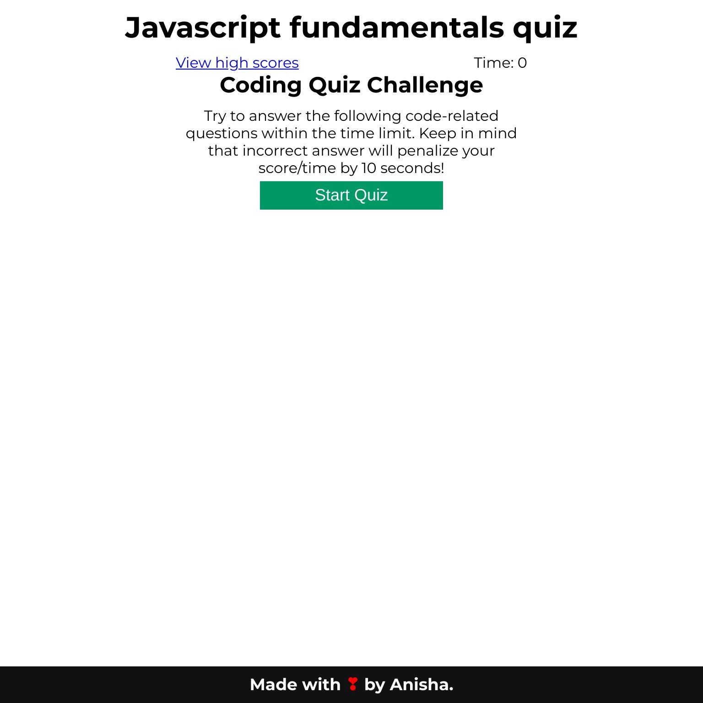
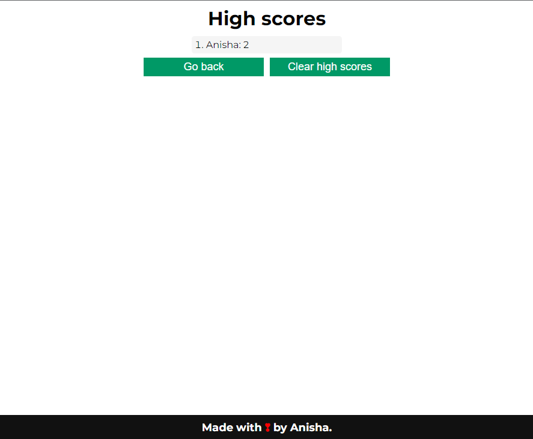

# javascript-fundamentals-quiz

Javascript fundamentals quiz game. Player has 75 seconds to answer as many questions as possible. Incorrect answer will result in time being reduced by 10 seconds.

## Live URL and screenshot

The game can be accessed via this [ur](https://anisha-sapkota.github.io/javascript-fundamentals-quiz/) and screenshots are below.

## Helpful resources

- <https://bost.ocks.org/mike/shuffle/>
- <https://developer.mozilla.org/en-US/docs/Web/API/Window/localStorage>
